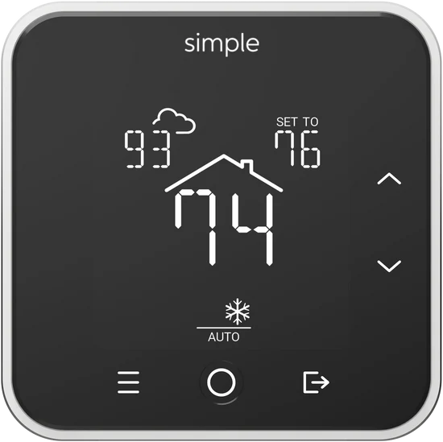
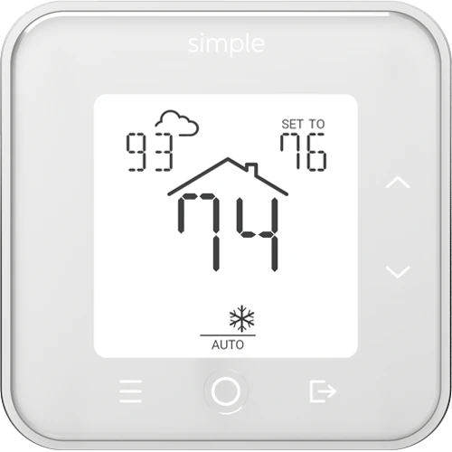

# The Simple WiFi Thermostat Home Assistant integration.

This integration is for users of Simple WiFi thermostat made by "[TheSimple](https://thesimple.com/)" which is accessed through [ecofactor.com](https://www.ecofactor.com).

 

## Installation via HACS

or
1. In Home Assistant, navigate to [**HACS**](https://www.hacs.xyz/docs/use/download/download/)
2. Search for and **install** `The Simple WiFi Thermostat`

## Manual Installation

1. Using your tool of choice open the directory (folder) for your HA configuration (where you find `configuration.yaml`).
2. If you do not have a `custom_components` directory (folder) there, you need to create it.
3. In the `custom_components` directory (folder) create a new folder called `simple`.
4. Download _all_ the files from the `custom_components/simple/` directory (folder) in this repository.
5. Place the files you downloaded in the new directory (folder) you created.
6. Restart Home Assistant

## Setup

or
1. Once installed, navigate to **Settings**/**Devices & services**.
2. Click **+ ADD INTEGRATION**
3. Search for "`The Simple WiFi Thermostat`"
4. Enter **UserName**/**Password** for [thesimple.com](https://thesimple.com/)

All thermostats associated with your account should appear in Home Assistant
