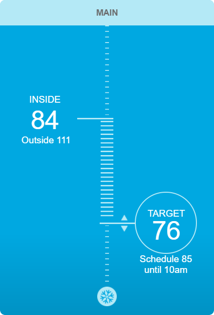

# simple

## Who

This integration is for users of Simple WiFi thermostat made by "[TheSimple](https://thesimple.com/)" which is accessed through [ecofactor.com](https://www.ecofactor.com). The interface for this thermostat looks like:



## Installation

1. Using your tool of choice open the directory (folder) for your HA configuration (where you find `configuration.yaml`).
2. If you do not have a `custom_components` directory (folder) there, you need to create it.
3. In the `custom_components` directory (folder) create a new folder called `simple`.
4. Download _all_ the files from the `custom_components/simple/` directory (folder) in this repository.
5. Place the files you downloaded in the new directory (folder) you created.
6. Edit your `configuration.yaml` file placing in the configuration below.
6. Restart Home Assistant

## Configuration.yaml entry

```
climate:
  - platform: simple
    username: "sample@user.com"
    password: "password goes here"
```

## Limitations

1. Supports multiple thermostats but only a single location.
